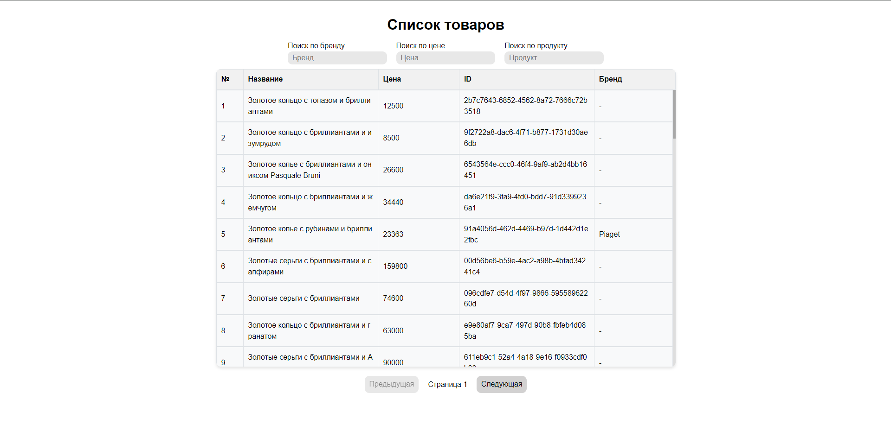
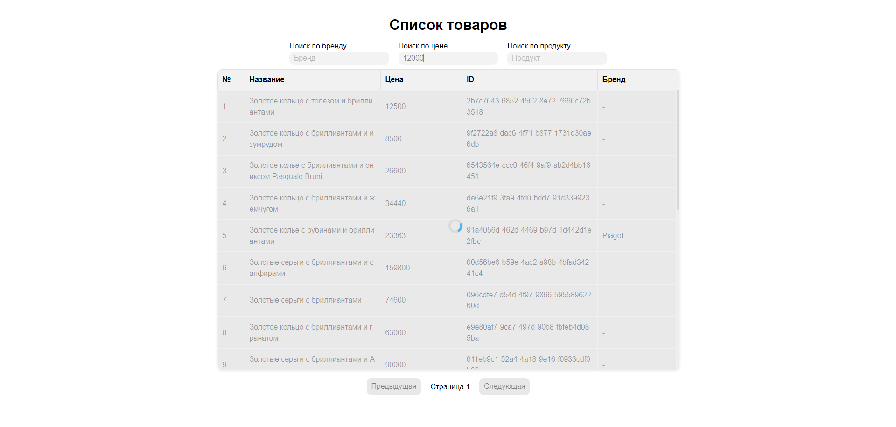
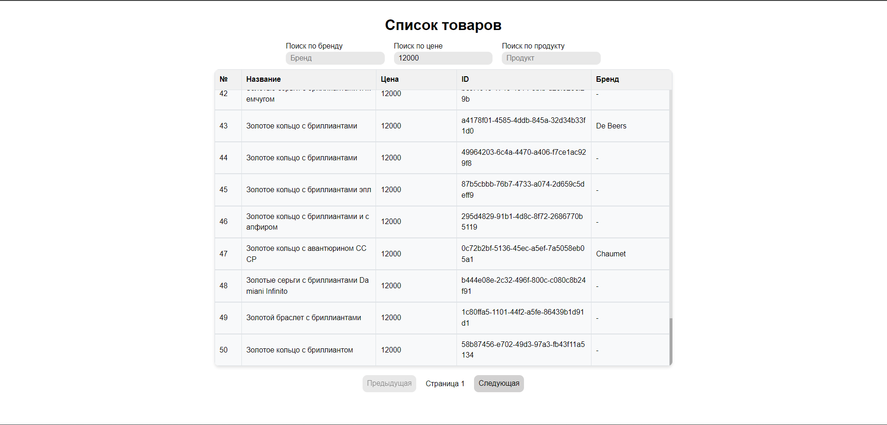

# Тестовое задание Front-end Developer

## Описание

Проект представляет собой реализацию работы с API для получения данных, а также их фильтрацию и отображение. .

---

### Технологии:

- TypeScript
- React
- SCSS
- RTK Query
- md5
- Vite

---

## Запуск приложения

### Установите зависимости:

> `pnpm install`

### Запустите приложение:

> `pnpm dev`

### Если у вас есть какие-либо вопросы или замечания по проекту, свяжитесь со мной:

- Email: vlad.loban.dev@gmail.com
- Telegram: https://t.me/vlad_loban

